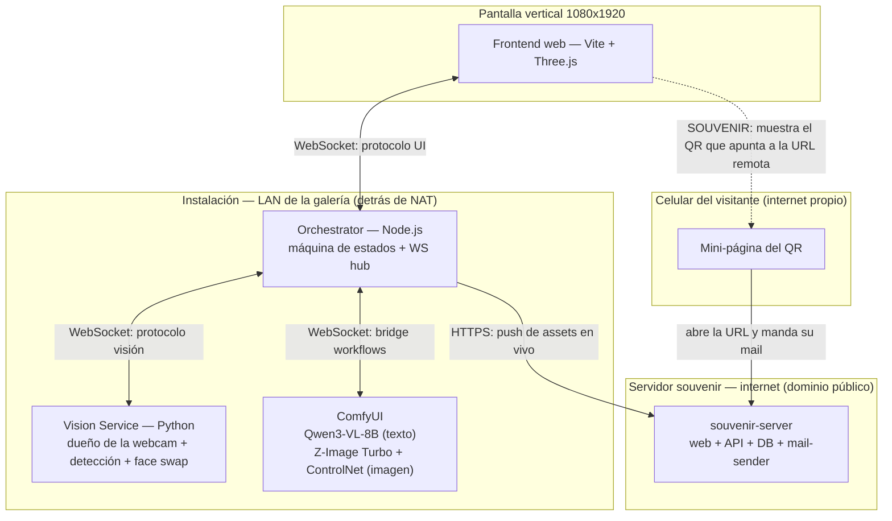

# El Espejo — Arquitectura Técnica

Este documento es la base técnica para implementar el backend y frontend descriptos en `espejo-ux-flow.md`. Está escrito para ser usado como contexto por un asistente de IA de código (ej. Claude Code) — define contratos explícitos (mensajes, formatos, estructura de carpetas) para minimizar decisiones ambiguas durante la implementación.

**Leer primero:** `espejo-ux-flow.md` (flujo de experiencia, estados, decisiones de diseño ya tomadas).

---

## 1. Visión general de servicios



**Nota (2026-09-05):** Ollama (puerto 11434) quedó como **legacy sin uso** — el texto (descripción + prompts) lo genera **Qwen3-VL-8B vía ComfyUI**, no Ollama. El face swap está **integrado en el Vision Service** (mismo proceso, puerto 3001), no es un proceso aparte.

**Nota (2026-09-06):** el souvenir NO vive en la instalación. Hay un **servidor remoto en internet** (`souvenir-server/`) que recibe los assets en vivo (push del Orchestrator) y, cuando el visitante manda su mail desde el QR, **arma y envía el correo con su propio SMTP**. Ver §8.

**Principio rector:** el Orchestrator es el único punto que conoce el estado global de la experiencia. Ningún otro servicio decide transiciones de estado — solo reportan eventos (Vision Service) o devuelven resultados (ComfyUI: texto + imagen). Esto evita lógica de estado duplicada y hace que el frontend sea "tonto" (solo renderiza lo que el Orchestrator le manda) — clave para que después sea fácil de rehacer sin tocar el resto.

### Por qué un Orchestrator central con WebSockets

La pieza central es el **Orchestrator (Node.js)**, un "director de orquesta" que posee la máquina de estados de la experiencia (REPOSO → … → ESPEJO_ACTIVO → …) y actúa como **hub de mensajería** entre el resto de los componentes. Elegimos esa forma de arquitectura por tres motivos principales:

1. **La experiencia es un flujo temporal, no un conjunto de páginas.** El espejo pasa por estados que duran decenas de segundos (encuadre, generación, revelación…) y en cada uno intervienen servicios distintos. Centralizar el estado en un solo proceso evita que cada componente tenga que "adivinar" en qué momento de la visita está — si el frontend o el Vision Service tuvieran lógica de estado propia, bastaría un desacuerdo entre dos de ellos para romper el ritmo de la pieza.

2. **Es una instalación en vivo con latencia y procesos largos.** El texto y el retrato salen de ComfyUI en *streaming* (tokens y previews que van apareciendo de a poco), no como respuestas HTTP de una sola vez. Los WebSockets dan un canal bidireccional y persistente ideal para eso: el Orchestrator empuja cada fragmento apenas llega (sin que el frontend tenga que preguntar "¿ya está?"), y el frontend puede mandar intenciones (saludar, capturar) en cualquier momento sin esperar una petición previa.

3. **Cada actor habla su propio idioma y el Orchestrator traduce.** El Vision Service habla de *presencia, gestos, fotos y frames*; ComfyUI habla de *workflows y nodos*; el frontend solo quiere *eventos visuales y assets*. En vez de acoplarlos entre sí, todos se conectan únicamente con el Orchestrator, que traduce los protocolos. Así, por ejemplo, el frontend nunca necesita saber cómo se llama ComfyUI ni dónde vive la webcam: recibe mensajes del dominio de la experiencia (`final_portrait`, `swap_frame`, `stream_chunk`). Esto también hace que reemplazar un servicio (como migrar la generación de texto de Ollama a Qwen vía ComfyUI) no toque al resto.

Como contrapartida, el Orchestrator es un punto único de falla — pero en una instalación local de una sola pieza eso es aceptable y simplifica mucho la puesta a punto. Y como el frontend es "tonto" y todo el estado vive en un solo lado, **recargar el navegador en medio de una visita se puede recuperar**: al reconectarse, el Orchestrator le reenvía a la sesión activa lo que ya se generó (foto y retrato), en lugar de reiniciar la experiencia.

---

## 2. Estructura de carpetas propuesta

```
espejo/
├── docs/
│   ├── espejo-ux-flow.md
│   └── espejo-arquitectura-tecnica.md   (este archivo)
│
├── orchestrator/                 # Node.js (puerto 3000)
│   ├── package.json
│   └── src/
│       ├── index.js               # arranque del servidor + wiring de eventos
│       ├── stateMachine.js         # lógica de estados y transiciones
│       ├── session.js              # manejo de sesión por visita (en memoria)
│       ├── ws/
│       │   ├── uiServer.js          # WS server hacia el frontend (+ resume de sesión)
│       │   └── visionClient.js      # WS client hacia Vision Service
│       ├── services/
│       │   ├── ollama.js            # ⚠ legacy, NO se usa (texto = Qwen vía ComfyUI)
│       │   ├── comfyui.js           # bridge a ComfyUI (2 workflows)
│       │   ├── souvenirWebClient.js # ⚠ placeholder — sube assets al servidor remoto (push en vivo)
│       │   └── mail.js              # ⚠ legacy/stub — el mail lo arma el servidor remoto
│       └── routes/
│           └── souvenir.js          # ⚠ legacy/stub — reemplazado por souvenir-server (remoto)
│
├── souvenir-server/               # Servidor remoto en internet — souvenir + mail
│   ├── package.json
│   ├── src/
│   │   ├── server.js               # arranca la web + API (express)
│   │   ├── api.js                  # REST: ingest de assets, guardar email, estado de sesión
│   │   ├── db.js                   # persistencia de sesiones (assets + email)
│   │   └── mail-sender.js          # arma el mail (template + assets) y lo envía por SMTP
│   ├── public/
│   │   └── index.html              # mini-página del form de mail (target del QR)
│   └── templates/
│       └── souvenir.html           # template del mail
│
├── vision-service/                # Python (puerto 3001) — dueño de la webcam
│   ├── requirements.txt
│   └── src/
│       ├── vision_server.py         # servidor WS + loop de cámara + threads
│       ├── detector.py              # detección unificada MediaPipe (cara + mano)
│       ├── capture.py               # captura de foto de referencia
│       ├── swapper.py               # face swap inswapper_128 (integrado, mismo proceso)
│       └── face_enhancer.py         # GFPGANv1.4 post-swap (restaura la cara)
│
├── frontend/                      # Vite + Three.js + TypeScript (puerto 5173)
│   └── src/
│       ├── main.ts                 # entry point — TODO el flujo visual en un solo módulo
│       ├── websocket-client.ts     # WsClient → Orchestrator, único punto de entrada de datos
│       ├── layers/                 # idle-field, face-fragments, face-assembly, lectura-*,
│       │                           # prompt-box, analysis-hud, face-tracker…
│       └── data/                   # dialogs.ts, word-bank.ts, lectura-messages.json
│
├── start.bat                       # arranca los servicios (vision con .venv-swap)
```

**Nota sobre el frontend:** toda la comunicación con el backend pasa por `websocket-client.ts`. El frontend es un solo entry (`main.ts`) con una máquina de estados visual propia — no hay módulos por estado separados como se proponía originalmente. Si en el futuro se rehace, solo hay que mantener el contrato de `wsClient`.

---

## 3. Protocolo WebSocket: Orchestrator ↔ Frontend

Todos los mensajes son JSON con un campo `type`. El Orchestrator es quien decide cuándo mandar cada uno — el frontend no pide nada activamente salvo conectarse.

### Mensajes Orchestrator → Frontend

```jsonc
// Cambio de estado (dispara la transición visual correspondiente)
{ "type": "state", "state": "REPOSO" | "DESPERTAR" | "CAPTURA" | "CONGELADO" | "LECTURA" | "GENERACION" | "REVELACION" | "ESPEJO_ACTIVO" | "SOUVENIR" | "CIERRE" }

// Cuenta regresiva antes de la foto
{ "type": "countdown", "value": 3 }

// Disparo del flash blanco (sincronizado con la captura real)
{ "type": "flash" }

// Foto de referencia ya capturada (para mostrar el frame congelado)
{ "type": "photo_captured", "image_b64": "..." }

// Streaming de texto — un canal por tipo de contenido
{ "type": "stream_chunk", "channel": "thinking_es" | "prompt_en" | "prompt_es", "text_delta": "...", "done": false }

// Preview de sampling de ComfyUI
{ "type": "gen_preview", "image_b64": "...", "step": 3, "total_steps": 8 }

// Texto de estado narrado durante la generación
{ "type": "gen_status", "text": "revelando…" }

// Imagen final generada
{ "type": "final_portrait", "image_b64": "..." }

// Frame de video con el face swap aplicado (estado Espejo Activo)
{ "type": "swap_frame", "image_b64": "..." }

// QR listo para el souvenir (incluye la URL con el session_id embebido)
{ "type": "qr_ready", "url": "https://.../souvenir?session=abc123" }

// Reset — vuelve todo a Reposo
{ "type": "reset" }
```

### Mensajes Frontend → Orchestrator

```jsonc
{ "type": "hello" }  // al conectar
{ "type": "continue" }  // avanzar DESPERTAR → CAPTURA (tras el saludo)
{ "type": "capture_photo", "crop_center_x": …, "crop_center_y": …, "crop_size": … }  // pedir la foto (con encuadre)
{ "type": "start_espejo" }  // REVELACION → ESPEJO_ACTIVO (tras el saludo)
```

**Nota de diseño:** el disparo principal es por gestos detectados en el Vision Service (el saludo con la mano), pero el frontend decide cuándo avanzar de fase (envía `continue` / `start_espejo`) y pide la captura con las coordenadas del encuadre.

---

## 4. Protocolo WebSocket: Orchestrator ↔ Vision Service

### Vision Service → Orchestrator

Además de los eventos JSON, el Vision Service manda **frames binarios** (JPEG de la cámara) todo el tiempo — son el preview en vivo que el Orchestrator reenvía al frontend.

```jsonc
{ "type": "presence", "value": true|false }
{ "type": "gesture_detected", "gesture": "wave" }
{ "type": "face_tracking", "x": 0.5, "y": 0.4, "width": 0.2, "height": 0.3, "present": true }  // posición normalizada de la cara
{ "type": "photo_ready", "image_b64": "..." }
{ "type": "swap_status", "active": bool, "ready": bool }  // el swap quedó listo
{ "type": "swap_frame", "image_b64": "..." }   // frame con el face swap aplicado (JSON, no binario)
```

### Orchestrator → Vision Service

```jsonc
{ "type": "capture_photo", "crop_center_x": …, "crop_center_y": …, "crop_size": … }  // tomar la foto con encuadre
{ "type": "start_swap", "image_b64": "..." }  // arrancar el face swap (portrait generado = cara fuente)
{ "type": "stop_swap" }
```

**Nota:** la detección de presencia corre siempre — es la señal de fondo. El frame binario del live preview **se pausa durante ESPEJO_ACTIVO** (el reflejo tapa el preview; libera CPU/GPU para el swap). El `swap_frame` va por JSON (base64), no por el canal binario.

---

## 5. Generación de texto — Qwen3-VL-8B vía ComfyUI (ya NO es Ollama)

**Actualizado 2026-09-05:** el texto ya no lo genera Ollama. `orchestrator/src/services/ollama.js` quedó como **legacy sin uso** (se importa pero nunca se llama). El texto sale del **workflow de texto de ComfyUI** (`EspejoIA_Qwen text generation.json`) que usa **Qwen3-VL-8B-Instruct** (GGUF).

El modelo mira la foto capturada y devuelve **tres salidas por separado** (se streamean al frontend como `stream_chunk` por canal):

```jsonc
{ "channel": "descripcion", "text_delta": "…" }   // descripción en español (se muestra)
{ "channel": "prompt_en", "text_delta": "…" }     // prompt en inglés → el que genera la imagen
{ "channel": "prompt_es", "text_delta": "…" }     // traducción al español (se muestra)
```

**Nota de implementación:** el workflow de texto corre en ComfyUI y emite por nodos (`prompt_en` = nodo 10, `descripcion` = nodo 11, `prompt_es` = nodo 12). El Orchestrator reenvía los chunks al frontend por canal a medida que llegan. Apenas llega `prompt_en`, dispara el workflow de imagen (ver §6).

---

## 6. Contrato con ComfyUI

Bridge Node.js implementado (`orchestrator/src/services/comfyui.js`). Pipeline de **dos fases**:

1. **Texto (QwenVL GGUF)** — workflow `EspejoIA_Qwen text generation.json`: foto → `prompt_en` (nodo 10), `descripcion` (nodo 11), `prompt_es` (nodo 12). Se streamean al frontend como `stream_chunk`.
2. **Imagen (Z-Image Turbo)** — workflow `EspejoIA_image.json`: foto + `prompt_en` → contornos, pasos intermedios y retrato final. Se dispara apenas llega `prompt_en`.

**Convención de prefijos de SaveImage (workflow de imagen):**
- `Espejo_Final` → el retrato completo. El orquestador lo elige por prefijo **y** `type === 'output'` (para no agarrar el `temp` del PreviewImage que era un paso intermedio).
- `Espejo_Step` → pasos intermedios del denoise (nodo 60). Se envían al frontend como `gen_preview` (progresión noise → final).
- `Canny` → contornos (nodo 56). Se envían como `canny_ready` apenas están listos.

**Eventos hacia el frontend:**
- `gen_preview` → frames de denoise (bpreview en vivo por WS + replay de `Espejo_Step` ordenados) con `step`/`total_steps`.
- `final_portrait` → retrato final real (`Espejo_Final`).
- `canny_ready` → contornos.

**Rendimiento:** RAM Cleanup desactivado en el workflow de imagen → los modelos de Z-Image Turbo quedan en VRAM entre ejecuciones. El nodo QwenVL `AILab_QwenVL_GGUF_PromptEnhancer` se recarga por corrida (ComfyUI crea instancia nueva por ejecución; no expone `keep_model_loaded`) — aceptado.

**Nota:** El warning `Error: extra_pnginfo[0] is not a dict or missing 'workflow' key` en la consola de ComfyUI es inofensivo — los PNG no llevan el workflow embebido, pero la generación no se afecta.

---

## 7. Pipeline de generación + Espejo Activo (face swap)

**Decisión:** El face swap del estado "Espejo Activo" usa **inswapper_128 + GFPGAN**, no LivePortrait. LivePortrait anima imágenes estáticas pero no hace face swap sobre un cuerpo en movimiento.

### Pipeline completo

```
    ┌─────────────────────────────────────────────────────────────┐
    │                     CAPTURA                                 │
    │   Cámara saca foto → imagen de referencia (720×1280)       │
    └──────────┬──────────────────────────────────────────────────┘
               │
               ▼
    ┌─────────────────────────────────────────────────────────────┐
    │              COMFYUI — TEXTO (QwenVL GGUF)                  │
    │   Recibe: foto + system prompt                              │
    │   Produce: descripcion + prompt_en + prompt_es              │
    │   Streaming: chunks → frontend como stream_chunk            │
    └──────────┬──────────────────────────────────────────────────┘
               │ prompt_en
               ▼
    ┌─────────────────────────────────────────────────────────────┐
    │              COMFYUI — IMAGEN (Z-Image Turbo)               │
    │   Recibe: foto + prompt_en                                  │
    │   Workflow: Canny/Lineart + Z-Image Turbo (KSamplerProgress)│
    │   Produce: Espejo_Step (pasos → gen_preview) + Espejo_Final │
    └──────────┬──────────────────────────────────────────────────┘
               │ retrato generado (source_face)
               ▼
    ┌─────────────────────────────────────────────────────────────┐
    │      FACE SWAP — integrado en el VISION SERVICE (3001)      │
    │   Recibe: retrato generado (vía orchestrator)               │
    │   Lee el último frame de cámara (video_buffer interno)      │
    │   Por cada frame:                                           │
    │     1. detecta cara (SCRFD) → inswapper_128 (paste nativo)  │
    │     2. GFPGAN → restaura la cara a 512px                    │
    │     3. swap_frame (JSON) → Orchestrator → Frontend          │
    │   ~174ms/frame → ~5-6 fps                                   │
    └─────────────────────────────────────────────────────────────┘
```

### Detalle: Face Swap (integrado en el Vision Service)

**Actualizado 2026-09-05:** el face swap NO corre como proceso aparte en el puerto 3002 — está **integrado en el Vision Service** (mismo proceso, puerto 3001). El Vision Service es el dueño de la webcam; hacer el swap en el mismo proceso evita que un segundo proceso compita por la cámara en Windows.

**Módulos:**
- `vision-service/src/swapper.py` — `FaceSwapper`: detección `buffalo_l` (SCRFD) + `inswapper_128`, onnxruntime-GPU.
- `vision-service/src/face_enhancer.py` — `FaceEnhancer`: GFPGANv1.4 (onnx, GPU) restaura la cara a 512×512 (elimina el pixelado del inswapper de 128px).

**Recibe del Orchestrator:**
```jsonc
{ "type": "start_swap", "image_b64": "<retrato generado>" }
{ "type": "stop_swap" }
```

**Envía al Orchestrator:**
```jsonc
{ "type": "swap_status", "active": true, "ready": true }  // listo para mostrar
{ "type": "swap_frame", "image_b64": "..." }              // frame con swap (~5-6 fps)
```

**Requerimientos (entorno `.venv-swap`, NUNCA `.venv`):**
- `inswapper_128.onnx` (528MB) en `vision-service/models/`
- `GFPGANv1.4.onnx` (324MB) en `vision-service/models/` (descargado de HuggingFace)
- `insightface` + `onnxruntime-gpu` en `.venv-swap`
- cuDNN/CUDA DLLs en `onnxruntime/capi` (copiados de ComfyUI)
- GPU RTX 5090 — ~174ms/frame → ~5-6 fps

### Flujo de estados completo

```
REPOSO → DESPERTAR → CAPTURA → CONGELADO → LECTURA → GENERACION → REVELACION → ESPEJO_ACTIVO → SOUVENIR → CIERRE → REPOSO
```

| Estado | Qué pasa |
|--------|----------|
| REPOSO | Loop ambiental (Voronoi, palabras, fragmentos de rostro) |
| DESPERTAR | Diálogo inicial, invitación a saludar |
| CAPTURA | Encuadre, countdown 3-2-1, flash, foto |
| CONGELADO | Foto capturada se muestra fija, arranca el workflow de texto (Qwen) |
| LECTURA | Streaming de descripcion (es) + prompt_en + prompt_es |
| GENERACION | ComfyUI generando, previews en vivo |
| REVELACION | Transición animada del retrato generado |
| ESPEJO_ACTIVO | Face swap en vivo (inswapper + GFPGAN) |
| SOUVENIR | QR + form de mail |
| CIERRE | Disolución, vuelta a REPOSO |

---

## 8. Souvenir + mail — servidor remoto

**Actualizado 2026-09-06:** el souvenir ya no lo maneja el Orchestrator local. Hay un **servidor remoto en internet** (`souvenir-server/`, dominio público) que recibe los assets en vivo y, cuando el visitante da su mail, **arma y envía el correo con su propio SMTP**.

**Por qué remoto:** el celular del visitante usa **su propio internet** (no la LAN de la instalación). Como el Orchestrator está detrás de NAT (sin IP pública), el que recibe conexiones es el servidor remoto — el Orchestrator solo **sale** hacia él por HTTPS.

### Servicios

| Servicio | Dónde vive | Rol |
|----------|-----------|-----|
| `souvenirWebClient.js` | Orchestrator (`services/`) | Cliente HTTP que **empuja cada asset** al servidor remoto apenas se genera |
| `souvenir-web` + `souvenir-api` | `souvenir-server/` (remoto) | Mini-página del form (target del QR) + endpoints REST |
| `db.js` | `souvenir-server/` (remoto) | Guarda `session_id → assets + email` |
| `mail-sender.js` | `souvenir-server/` (remoto) | Arma el mail (template + assets) y lo envía por SMTP |

### Flujo

1. Al capturar, el Orchestrator crea el `session_id` (UUID) y, apenas tiene cada asset (foto, texto, retrato), lo empuja en vivo con `souvenirWebClient`:
   `POST https://<dominio>/api/sessions/<id>/assets` → `{ type: 'photo'|'descripcion'|'prompt_en'|'prompt_es'|'portrait', data_b64 }`
2. En SOUVENIR, el frontend muestra un QR que apunta a la URL del servidor remoto: `https://<dominio>/souvenir?session=<session_id>`.
3. El celular (internet propio) abre la mini-página y manda su mail:
   `POST https://<dominio>/api/sessions/<id>/email` → `{ email }`.
4. Cuando una sesión tiene `email` + assets completos, `mail-sender.js` arma el mail (template con foto original, `descripcion`, `prompt_en` + `prompt_es`, retrato y link al manifiesto) y lo envía por **SMTP del propio servidor remoto**.

**Nota:** los endpoints locales legacy (`orchestrator/src/routes/souvenir.js` y `services/mail.js`) quedan como stub sin uso en este diseño — el envío lo dispara el servidor remoto cuando la sesión está completa.

---

## 9. Manejo de sesión

Cada visita genera un `session_id` (UUID) al momento de la captura de foto (estado 3). Se usa para:
- Asociar la foto, el pensamiento, los prompts y el retrato generado mientras dura la visita.
- Embeberse en la URL del QR (`?session=abc123`), para que el form de souvenir sepa qué assets pedir.

**Almacenamiento:** para esta primera versión, alcanza con guardar los assets de la sesión activa en memoria en el Orchestrator (un objeto/mapa `session_id → { photo, descripcion, prompt_en, prompt_es, portrait }` — en código `session.js` conserva la clave legacy `pensamiento_es` sin uso; hoy lo que se persiste de verdad es `photo` + `prompt_en` + `portrait`), con limpieza al volver a Reposo o tras un timeout. No hace falta base de datos local.

**⚠ Nueva responsabilidad (2026-09-06):** además de la memoria local, el Orchestrator **empuja los assets al servidor remoto** (`souvenir-server/`) apenas se generan, vía `souvenirWebClient.js`. Así, la sesión remota queda completa sin depender de que la local siga viva cuando la persona escanea el QR (el límite local de 10 min ya no condiciona el envío del souvenir).

---

## 10. Orden de implementación sugerido (milestones)

Pensado para ir probando cada parte de forma aislada antes de integrar, útil para vibecodear paso a paso:

1. **Vision Service standalone**: detección de presencia + gesto + captura de foto. ✅ **Completo**
2. **Orchestrator esqueleto**: máquina de estados, WS server, conexión con Vision Service. ✅ **Completo**
3. **Frontend — REPOSO + Encuadre**: camera feed overlay, diálogos, encuadre, countdown, captura. ✅ **Completo**
4. **Generación de texto**: streaming de descripcion + prompt_en + prompt_es al frontend. ✅ **Completo** — originalmente con Ollama; **migrado a Qwen3-VL-8B vía ComfyUI** (Ollama quedó legacy sin uso)
5. **ComfyUI — imagen**: Z-Image Turbo + ControlNet/Lineart con previews + retrato. ✅ **Completo**
6. **Face Swap (inswapper + GFPGAN)**: **integrado en el Vision Service** (mismo proceso, no servicio aparte). ✅ **Completo** — con `swap_status` que dispara la transición de entrada
7. **Conectar todo**: flujo completo captura → texto → imagen → face swap → frontend, con la transición de entrada al espejo. ✅ **Completo**
8. **Souvenir + mail (servidor remoto)**: QR + mini-página + servidor remoto (`souvenir-server/`) + push en vivo + envío SMTP. 🔶 **En diseño** — arquitectura definida el 2026-09-06; faltan implementar `souvenir-server/`, `souvenirWebClient.js` y el QR en el frontend
9. **Pulido de bordes**: timeouts por estado, manejo de abandono, reset transversal. 🔶 **Parcial** — hay reset transversal + resume de sesión; faltan timeouts finos por estado

---

## 11. Preguntas técnicas abiertas

- Transporte de `swap_frame`: **decidido** — JPEG base64 como JSON sobre WebSocket. Con GFPGAN da ~5-6 fps (toggle `ENHANCE_FACE` en `swapper.py` si se quiere más fps y menos calidad).
- **Calibración de la transición de entrada al espejo** (vórtice / polaroid / cobra vida): duraciones, tamaños e intensidad según pruebas de piso.
- Dominio/hosting del servidor remoto (`souvenir-server/`) y su certificado HTTPS.
- **Auth del push de assets**: cómo se autentica el Orchestrator al subir assets (token compartido por sesión o secreto global) — evitar que cualquiera inyecte assets a sesiones ajenas.
- Detalles de SMTP del servidor remoto (proveedor/configuración) y el contenido final del manifiesto al que enlaza el mail.
- Cómo el QR llega a la URL correcta: el Orchestrator debe conocer el dominio remoto (config) para pasarle al frontend la URL a codificar.
- Timeouts específicos por estado (valores a ajustar en ensayo de piso).
- **Disolución / CIERRE** (estado 10 del UX flow): la cara generada se desintegra de vuelta al ruido al cerrar — aún no implementado.
