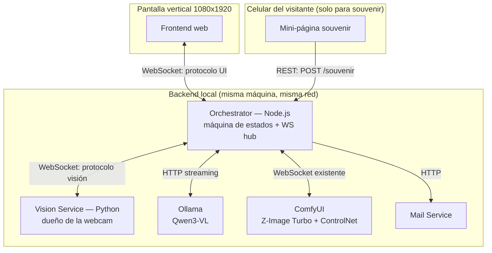

# El Espejo — Arquitectura Técnica

Este documento es la base técnica para implementar el backend y frontend descriptos en `espejo-ux-flow.md`. Está escrito para ser usado como contexto por un asistente de IA de código (ej. Claude Code) — define contratos explícitos (mensajes, formatos, estructura de carpetas) para minimizar decisiones ambiguas durante la implementación.

**Leer primero:** `espejo-ux-flow.md` (flujo de experiencia, estados, decisiones de diseño ya tomadas).

---

## 1. Visión general de servicios



**Principio rector:** el Orchestrator es el único punto que conoce el estado global de la experiencia. Ningún otro servicio decide transiciones de estado — solo reportan eventos (Vision Service) o devuelven resultados (Ollama, ComfyUI). Esto evita lógica de estado duplicada y hace que el frontend sea "tonto" (solo renderiza lo que el Orchestrator le manda) — clave para que después sea fácil de rehacer sin tocar el resto.

---

## 2. Estructura de carpetas propuesta

```
espejo/
├── docs/
│   ├── espejo-ux-flow.md
│   └── espejo-arquitectura-tecnica.md   (este archivo)
│
├── orchestrator/                 # Node.js
│   ├── package.json
│   └── src/
│       ├── index.js               # arranque del servidor
│       ├── stateMachine.js         # lógica de estados y transiciones
│       ├── session.js              # manejo de sesión por visita
│       ├── ws/
│       │   ├── uiServer.js          # WS server hacia el frontend
│       │   └── visionClient.js      # WS client hacia Vision Service
│       ├── services/
│       │   ├── ollama.js            # llamada streaming a Ollama
│       │   ├── comfyui.js           # bridge existente a ComfyUI (adaptado)
│       │   └── mail.js              # envío de mail
│       └── routes/
│           └── souvenir.js          # REST endpoint para el form de mail
│
├── vision-service/                # Python
│   ├── requirements.txt
│   └── src/
│       ├── main.py                 # servidor WS + loop de cámara
│       ├── presence.py             # detección de presencia
│       ├── gesture.py              # detección de gesto de saludo
│       ├── capture.py              # captura de foto de referencia
│       └── faceswap.py             # insightface + inswapper, streaming
│
├── frontend/                      # webapp de la pantalla vertical
│   └── src/
│       ├── index.html
│       ├── wsClient.js             # conexión al Orchestrator, único punto de entrada de datos
│       └── states/                 # un módulo/componente por estado del flujo
│           ├── reposo.js
│           ├── despertar.js
│           ├── captura.js
│           ├── lectura.js
│           ├── generacion.js
│           ├── revelacion.js
│           ├── espejoActivo.js
│           └── souvenir.js
│
└── souvenir-app/                   # mini-página que abre el visitante en su celular
    └── src/
        └── index.html               # form de mail, hace POST a /souvenir
```

**Nota sobre el frontend:** toda la comunicación con el backend pasa por `wsClient.js`. Si en el futuro se rehace el frontend (otro framework, otro diseño visual), **solo hay que reimplementar los módulos de `states/` y mantener el contrato de `wsClient.js`** — el Orchestrator no cambia.

---

## 3. Protocolo WebSocket: Orchestrator ↔ Frontend

Todos los mensajes son JSON con un campo `type`. El Orchestrator es quien decide cuándo mandar cada uno — el frontend no pide nada activamente salvo conectarse.

### Mensajes Orchestrator → Frontend

```jsonc
// Cambio de estado (dispara la transición visual correspondiente)
{ "type": "state", "state": "REPOSO" | "DESPERTAR" | "CAPTURA" | "CONGELADO" | "LECTURA" | "GENERACION" | "REVELACION" | "ESPEJO_ACTIVO" | "SOUVENIR" | "CIERRE" }

// Cuenta regresiva antes de la foto
{ "type": "countdown", "value": 3 }

// Disparo del flash blanco (sincronizado con la captura real)
{ "type": "flash" }

// Foto de referencia ya capturada (para mostrar el frame congelado)
{ "type": "photo_captured", "image_b64": "..." }

// Streaming de texto — un canal por tipo de contenido
{ "type": "stream_chunk", "channel": "thinking_es" | "prompt_en" | "prompt_es", "text_delta": "...", "done": false }

// Preview de sampling de ComfyUI
{ "type": "gen_preview", "image_b64": "...", "step": 3, "total_steps": 8 }

// Texto de estado narrado durante la generación
{ "type": "gen_status", "text": "revelando…" }

// Imagen final generada
{ "type": "final_portrait", "image_b64": "..." }

// Frame de video con el face swap aplicado (estado Espejo Activo)
{ "type": "swap_frame", "image_b64": "..." }

// QR listo para el souvenir (incluye la URL con el session_id embebido)
{ "type": "qr_ready", "url": "https://.../souvenir?session=abc123" }

// Reset — vuelve todo a Reposo
{ "type": "reset" }
```

### Mensajes Frontend → Orchestrator

El frontend es mayormente pasivo. Único mensaje necesario:

```jsonc
{ "type": "hello" }  // al conectar, para que el Orchestrator sepa que hay un cliente activo
```

**Nota de diseño:** deliberadamente no hay mensajes de "click" o "confirmar" del lado del frontend — toda la lógica de disparo vive en las detecciones del Vision Service. Esto es coherente con la decisión de UX de minimizar la interfaz operable.

---

## 4. Protocolo WebSocket: Orchestrator ↔ Vision Service

### Vision Service → Orchestrator

```jsonc
{ "type": "presence", "value": true }
{ "type": "presence", "value": false }
{ "type": "gesture_detected", "gesture": "wave" }
{ "type": "photo_ready", "image_b64": "..." }
{ "type": "swap_frame", "image_b64": "..." }   // uno por cada frame procesado, mientras esté activo el swap
```

### Orchestrator → Vision Service

```jsonc
{ "type": "start_gesture_watch" }     // empezar a buscar el gesto de saludo
{ "type": "capture_photo" }            // tomar la foto de referencia ahora
{ "type": "start_swap", "source_face_b64": "..." }  // arrancar el loop de face swap con esta cara como fuente
{ "type": "stop_swap" }
```

**Nota:** la detección de presencia (`presence`) corre siempre, sin necesidad de que el Orchestrator la pida — es la señal de fondo que dispara el reset transversal en cualquier estado.

---

## 5. Contrato con Ollama

Llamada HTTP con streaming (`stream: true`) a `http://localhost:11434/api/chat`, con una imagen adjunta (la foto capturada) y un **system prompt** que le pide al modelo devolver los tres campos definidos en la sección de idioma del documento de UX.

**Formato de respuesta esperado (parseado del streaming):**

```jsonc
{
  "pensamiento_es": "...",   // narrativo, se muestra primero
  "prompt_en": "...",         // el que se envía a ComfyUI
  "prompt_es": "..."          // traducción visible, no se usa para generar
}
```

**Nota de implementación:** como el streaming llega token por token y no como JSON completo hasta el final, conviene:
- Diseñar el system prompt para que el modelo escriba los campos en un orden fijo y delimitado (ej. marcadores de texto simples tipo `[PENSAMIENTO]...[PROMPT_EN]...[PROMPT_ES]...`), en vez de JSON crudo — más fácil de parsear incrementalmente mientras llegan los chunks, sin esperar a que cierre una estructura JSON válida.
- El Orchestrator va parseando el stream y reenviando `stream_chunk` al frontend por canal, a medida que identifica en qué sección del delimitador está.

---

## 6. Contrato con ComfyUI

Se mantiene el bridge Node.js ya construido (workflow vía websocket). Cambios necesarios respecto a lo que ya existe:
- El Orchestrator escucha los mensajes de `progress`/preview que ComfyUI ya emite por su propio protocolo, y los traduce a `gen_preview` para el frontend.
- El prompt de texto que se inyecta al workflow es `prompt_en` (el que llega de Ollama), no lo que tipeaba manualmente antes.

---

## 7. Pipeline de generación + Espejo Activo (face swap)

**Decisión:** El face swap del estado "Espejo Activo" usa **inswapper_128 + GFPGAN**, no LivePortrait. LivePortrait anima imágenes estáticas pero no hace face swap sobre un cuerpo en movimiento.

### Pipeline completo

```
    ┌─────────────────────────────────────────────────────────────┐
    │                     CAPTURA                                 │
    │   Cámara saca foto → imagen de referencia (720×1280)       │
    └──────────┬──────────────────────────────────────────────────┘
               │
               ▼
    ┌─────────────────────────────────────────────────────────────┐
    │                     OLLAMA (Qwen3-VL)                       │
    │   Recibe: foto + system prompt                              │
    │   Produce: pensamiento_es + prompt_en + prompt_es           │
    │   Streaming: chunks → frontend como stream_chunk            │
    └──────────┬──────────────────────────────────────────────────┘
               │ prompt_en
               ▼
    ┌─────────────────────────────────────────────────────────────┐
    │              COMFYUI (Z-Image Turbo + ControlNet)           │
    │   Recibe: foto + prompt_en                                  │
    │   Workflow: ControlNet (canny/softedge) + Z-Image Turbo     │
    │   Produce: previews (step → gen_preview) + retrato final    │
    └──────────┬──────────────────────────────────────────────────┘
               │ retrato generado (source_face)
               ▼
    ┌─────────────────────────────────────────────────────────────┐
    │           FACE SWAP (inswapper_128 + GFPGAN)                │
    │   Recibe: source_face (retrato generado)                    │
    │   Recibe: live camera feed (frames desde Vision Service)    │
    │   Por cada frame:                                           │
    │     1. inswapper_128 → swap rápido (~30fps)                 │
    │     2. GFPGAN → restaura detalles de la cara                │
    │     3. Envía swap_frame al Orchestrator → Frontend          │
    └─────────────────────────────────────────────────────────────┘
```

### Detalle: Face Swap Service (Python)

Corre como proceso independiente (similar al Vision Service pero para swap). Se comunica con el Orchestrator vía WebSocket en puerto 3002.

**Recibe del Orchestrator:**
```jsonc
{ "type": "start", "source_face_b64": "..." }  // retrato generado
{ "type": "frame", "image_b64": "..." }         // frame de cámara (reenviado desde Vision Service)
{ "type": "stop" }
```

**Envía al Orchestrator:**
```jsonc
{ "type": "swap_frame", "image_b64": "..." }   // frame con swap aplicado (~20-30 fps)
{ "type": "ready" }
{ "type": "error", "message": "..." }
```

**Requerimientos:**
- `inswapper_128.onnx` — ya existe en `Face Swap testing/`
- `insightface` — ya instalado en `.venv`
- `gfpgan` — hay que instalarlo (pip)
- GPU recomendada (NVIDIA) para tiempo real (~30ms por frame)

### Flujo de estados completo

```
REPOSO → DESPERTAR → CAPTURA → CONGELADO → LECTURA → GENERACION → REVELACION → ESPEJO_ACTIVO → SOUVENIR → CIERRE → REPOSO
```

| Estado | Qué pasa |
|--------|----------|
| REPOSO | Loop ambiental (Voronoi, palabras, fragmentos de rostro) |
| DESPERTAR | Diálogo inicial, invitación a saludar |
| CAPTURA | Encuadre, countdown 3-2-1, flash, foto |
| CONGELADO | Foto capturada se muestra fija, arranca llamada a Ollama |
| LECTURA | Streaming de pensamiento_es + prompt_en + prompt_es |
| GENERACION | ComfyUI generando, previews en vivo |
| REVELACION | Transición animada del retrato generado |
| ESPEJO_ACTIVO | Face swap en vivo (inswapper + GFPGAN) |
| SOUVENIR | QR + form de mail |
| CIERRE | Disolución, vuelta a REPOSO |

---

## 8. Servicio de mail

Disparado por el endpoint `POST /souvenir` (llamado desde `souvenir-app` cuando el visitante completa su mail). El Orchestrator busca los assets de esa sesión (`session_id` embebido en la URL del QR) y arma el envío con:
- Foto original
- `pensamiento_es`
- `prompt_en` + `prompt_es`
- Retrato generado
- Link al manifiesto/explicación técnica (URL fija, no depende de la sesión)

**Pendiente de decidir:** proveedor de envío (SMTP propio vs. API tipo Resend/SendGrid) — cualquiera de las dos opciones encaja en `services/mail.js` sin afectar el resto de la arquitectura.

---

## 9. Manejo de sesión

Cada visita genera un `session_id` (UUID) al momento de la captura de foto (estado 3). Se usa para:
- Asociar la foto, el pensamiento, los prompts y el retrato generado mientras dura la visita.
- Embeberse en la URL del QR (`?session=abc123`), para que el form de souvenir sepa qué assets pedir.

**Almacenamiento:** para esta primera versión, alcanza con guardar los assets de la sesión activa en memoria en el Orchestrator (un objeto/mapa `session_id → { photo, pensamiento_es, prompt_en, prompt_es, portrait }`), con limpieza al volver a Reposo o tras un timeout. No hace falta base de datos todavía — se puede sumar después si se integra el muro de acumulación.

---

## 10. Orden de implementación sugerido (milestones)

Pensado para ir probando cada parte de forma aislada antes de integrar, útil para vibecodear paso a paso:

1. **Vision Service standalone**: detección de presencia + gesto + captura de foto. ✅ **Completo**
2. **Orchestrator esqueleto**: máquina de estados, WS server, conexión con Vision Service. ✅ **Completo**
3. **Frontend — REPOSO + Encuadre**: camera feed overlay, diálogos, encuadre, countdown, captura. ✅ **Completo**
4. **Ollama**: streaming real de pensamiento/prompt hacia el frontend.
5. **ComfyUI**: generación con previews a partir de foto + prompt_en.
6. **Face Swap Service (inswapper + GFPGAN)**: servicio Python que recibe retrato generado y feed de cámara, devuelve frames con swap.
7. **Conectar todo**: flujo completo desde captura → Ollama → ComfyUI → Face Swap → frontend.
8. **Souvenir + mail**: QR, mini-página, endpoint, envío de mail.
9. **Pulido de bordes**: timeouts por estado, manejo de abandono, reset transversal.

---

## 11. Preguntas técnicas abiertas

- Formato exacto de transporte para `swap_frame` — JPEG base64 sobre WebSocket (más simple de implementar) vs. un canal de video más eficiente (MJPEG stream o WebRTC) si el framerate con base64 no alcanza. Se decide en el milestone 7 según pruebas reales de latencia.
- Proveedor de mail (SMTP vs. API).
- Timeouts específicos por estado (valores a ajustar en ensayo de piso).
- Dónde vive el contenido del manifiesto (página estática propia vs. sección del sitio del proyecto).
