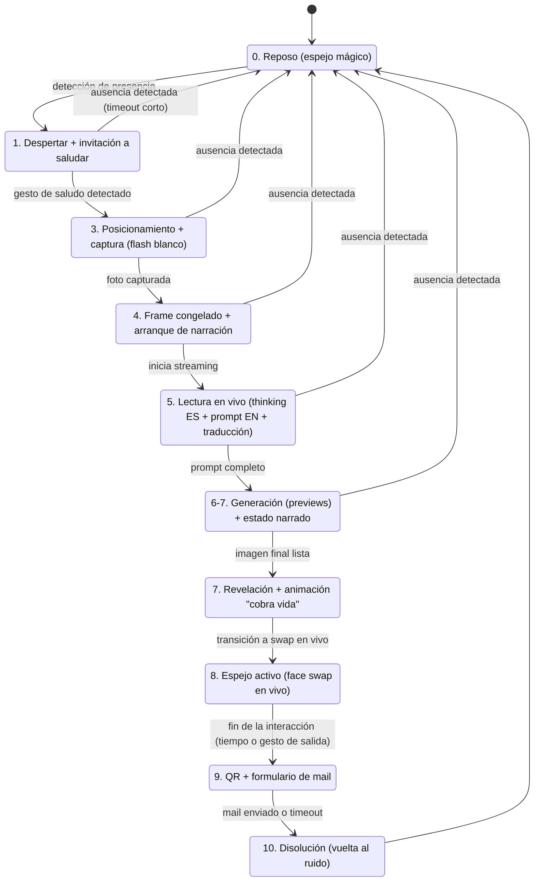
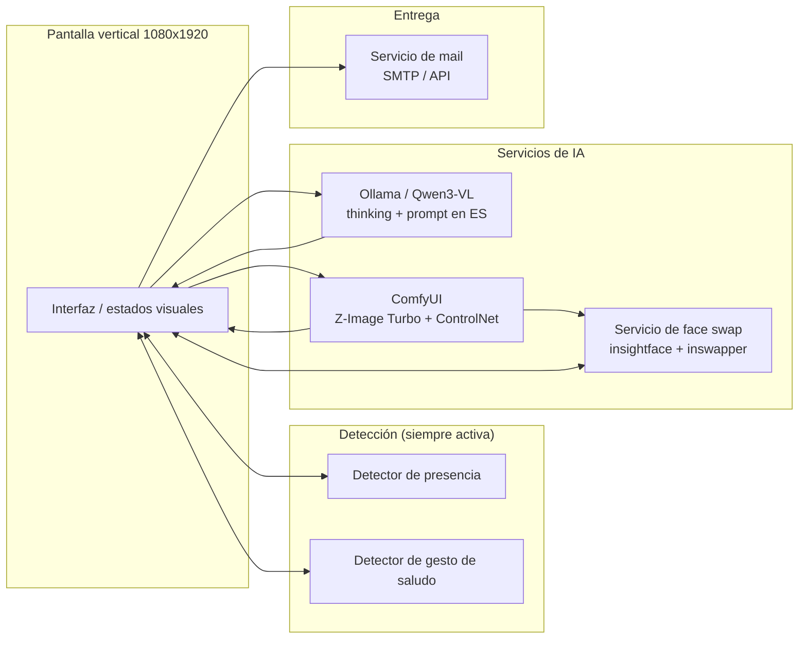

# El Espejo — Experiencia de Usuario

Documento de referencia para el flujo de interacción de la instalación. Describe qué pasa en pantalla, paso a paso, y cómo se conecta cada estado con los distintos servicios del backend (sin entrar en detalle técnico de implementación — eso queda para el documento de arquitectura).

---

## 1. Diagrama de estados

**Regla general de reseteo:** desde cualquier estado posterior a "Despertar", si el detector de presencia deja de ver a la persona durante X segundos, el sistema corta y vuelve a Reposo. X es un parámetro a ajustar en pruebas de piso (probablemente distinto según el estado — más corto en Despertar, más largo una vez que ya invirtió tiempo generando).

---

## 2. Estados en detalle

### 0. Reposo — el espejo mágico
- Superficie oscura/opaca en loop ambiental. Sugerencias tenues de múltiples rostros posibles moviéndose o disolviéndose — nunca formas nítidas, solo la sensación de que "hay algo ahí adentro".
- Sin texto, sin instrucciones, sin UI visible.
- Backend: detector de presencia corriendo en segundo plano sobre el feed de cámara, todo el tiempo.

### 1. Despertar + invitación a saludar
- Se detecta rostro/cuerpo frente al espejo → la animación ambiental reacciona (el espejo "abre un ojo").
- Aparece una instrucción mínima invitando a saludar.
- El gesto de saludo (detectado sobre el mismo feed) dispara el siguiente estado.
- Si la persona se va sin saludar → vuelta a Reposo.

### 2. Ausencia → reset (regla transversal)
- No es un paso narrativo, es una condición de salida activa en todos los estados desde el 1 en adelante.
- Se resuelve con el mismo detector de presencia de fondo, sin lógica nueva.

### 3. Posicionamiento + captura
- La pantalla indica dónde pararse (silueta guía o marco).
- Cuenta regresiva breve.
- En el instante exacto de la captura, la pantalla se pone completamente blanca — doble función: efecto de "flash mágico" + luz de relleno real para mejorar la foto de referencia (clave para el ControlNet después).

### 4. Frame congelado + arranque de narración
- La foto capturada queda fija en pantalla.
- El espejo "empieza a hablar" sobre esa misma imagen — sin cambio brusco de pantalla.

### 5. Lectura en vivo (thinking + prompt)
- Streaming de texto tipo máquina de escribir: primero el "pensamiento" del modelo sobre lo que ve (en **español**), después el prompt técnico que arma a partir de eso.
- **Decisión de diseño:** el prompt que efectivamente genera la imagen se produce en **inglés** (mejor adherencia y calidad con Z-Image Turbo, cuyo text encoder tiene inglés/chino como idiomas de primera clase y el resto como capacidad emergente, menos confiable). En vez de ocultar esto con una traducción transparente, se **muestra el prompt en inglés tal cual se usó**, junto con su traducción al español generada en la misma llamada — el gesto de traducción queda expuesto, no disuelto.
- Conceptualmente, esto expone una capa más de sesgo estructural del modelo (piensa por defecto en el idioma dominante de su entrenamiento, no en el del visitante) — coherente con el compromiso de no tapar las estructuras de poder que la pieza critica.
- Técnicamente se resuelve en una sola llamada a Qwen (sin paso de traducción aparte): la respuesta incluye el pensamiento en español, el prompt final en inglés, y su traducción al español — se retoma en el documento de arquitectura técnica.

### 6-7. Generación + estado narrado
- Previews de sampling apareciendo en vivo (la imagen emergiendo del ruido).
- Texto de estado tipo "mirando…", "interpretando…", "revelando…" acompañando el proceso.
- Pendiente de definir con pruebas visuales: si el texto del prompt y los previews de imagen se muestran secuencialmente o solapados.

### 7. Revelación + "cobra vida"
- La imagen final generada se muestra fija un instante.
- Animación de transición que la hace pasar de estática a viva — el puente directo hacia el face swap en vivo.

### 8. Espejo activo (face swap en vivo)
- El visitante se mueve; el espejo devuelve su gesto real con la cara generada superpuesta.
- Duración y condición de salida: a definir con pruebas de piso.

### 9. Souvenir
- Aparece un QR en pantalla.
- El visitante escanea con su propio celular y completa su mail en una mini-página aparte (esta sí es una interacción legítima de celular, porque es una función de salida/entrega, no de control de la experiencia — no compite con la inmersión del espejo).
- Recibe por mail: la foto original, el texto del "thinking" en español, el prompt usado en inglés junto con su traducción, y el retrato generado.
- El mail incluye además un **link a un manifiesto / explicación técnica** del proyecto (qué pasa detrás de escena, marco conceptual, créditos) — funciona como cierre reflexivo de la experiencia, ya fuera del momento inmersivo frente al espejo. Contenido y formato del manifiesto: pendiente de definir.

### 10. Disolución
- La cara generada no desaparece de golpe: se desintegra visualmente de vuelta al ruido / universo de rostros ambiental del estado 0 — conectando el cierre individual con el fondo colectivo.

### 11. Vuelta a Reposo

---

## 3. Mapa de componentes involucrados por estado

---

## 4. Preguntas abiertas (a resolver en pruebas o en la etapa técnica)

- Duración exacta del estado 8 (espejo activo) — a ajustar en ensayo.
- Cómo se comporta el sistema si el visitante completa el formulario de mail pero se retira antes de terminar el paso 8.
- Solapamiento visual entre el prompt (texto) y los previews de generación (imagen) en los estados 6-7.
- Tiempos de timeout específicos por estado (probablemente distintos entre "Despertar" y los estados posteriores, donde ya hay tiempo de generación invertido).
- Si el "universo de rostros" del estado 0/10 se conecta o no con un muro de acumulación físico separado — todavía sin decidir.
- Servicio de envío de mail (SMTP propio vs. API tipo Resend/SendGrid) — pendiente, se define en la arquitectura técnica.
- Contenido y formato del manifiesto/explicación técnica enlazado en el mail — pendiente.

---

## 5. Notas de idioma (Qwen)

**Decisión final:** el modelo (Qwen3-VL vía Ollama) genera, en una sola llamada:
1. El "thinking" narrativo en **español** (lo que se muestra primero, streameado).
2. El prompt técnico final en **inglés** (el que efectivamente se envía a Z-Image Turbo — mejor adherencia y calidad).
3. La traducción al español de ese mismo prompt (se muestra junto al original en inglés, sin ocultar el paso de traducción).

Razón técnica: el text encoder de Z-Image Turbo (Qwen3-4B) tiene inglés y chino como idiomas de primera clase; el resto de los idiomas, incluido el español, funcionan por una capacidad multilingüe emergente, menos confiable para adherencia de prompt.

Razón conceptual: mostrar el prompt en inglés + su traducción, en vez de generar directo en español y ocultar el original, expone una capa más de sesgo estructural del modelo — coherente con el compromiso de la pieza de no disimular las estructuras de poder que critica.

Se retoma el detalle de implementación (estructura de la respuesta de Qwen, ej. JSON con los tres campos) en el documento de arquitectura técnica.
